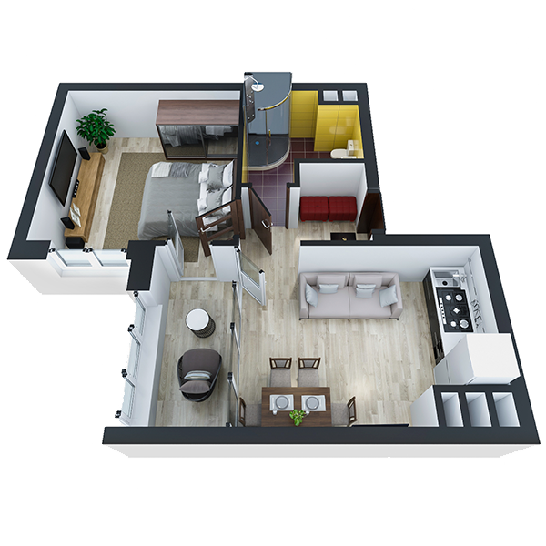

# План квартири 1k2_b

| Тип   | Загальна площа | Житлова площа |
| ----- | -------------- | ------------- |
| 1k2_b | 39.34          | 13.97         |

| Приміщення                | Площа |
| ------------------------- | ----- |
| 1.Кімната                 | 13.97 |
| 2.Кухня                   | 12.67 |
| 3.Ванна кімната           | 4.75  |
| 4.Коридор                 | 3.60  |
| 5.Засклена лоджія (k=1.0) | 4.35  |

## План приміщення

<iframe src="plan.pdf" width="100%" height="620" style="border:none;"></iframe>

[⬇ Завантажити план приміщення](plan.pdf){ .md-button }

## План поверху

<iframe src="floor.pdf" width="100%" height="620" style="border:none;"></iframe>

[⬇ Завантажити план поверху](floor.pdf){ .md-button }