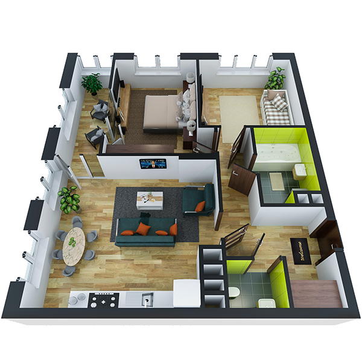

# План квартири 2c1_a

| Тип   | Загальна площа | Житлова площа |
| ----- | -------------- | ------------- |
| 2c1_a | 68.85          | 25.09         |

| Приміщення                | Площа |
| ------------------------- | ----- |
| 1.Кімната                 | 13.96 |
| 2.Кімната                 | 11.13 |
| 3.Кухня-вітальня          | 22.14 |
| 4.Ванна кімната           | 4.53  |
| 5.Санвузол                | 1.78  |
| 6.Коридор                 | 7.49  |
| 7.Гардеробна              | 1.78  |
| 8.Засклена лоджія (k=1.0) | 6.04  |

## План приміщення

<iframe src="plan.pdf" width="100%" height="620" style="border:none;"></iframe>

[⬇ Завантажити план приміщення](plan.pdf){ .md-button }

## План поверху

<iframe src="floor.pdf" width="100%" height="620" style="border:none;"></iframe>

[⬇ Завантажити план поверху](floor.pdf){ .md-button }