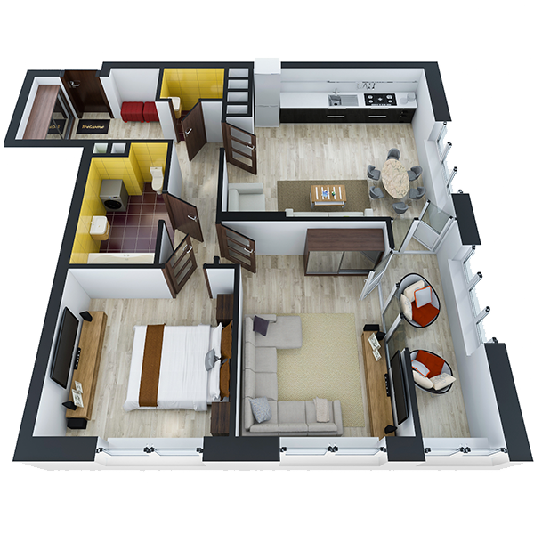

# План квартири 2c4_b

| Тип   | Загальна площа | Житлова площа |
| ----- | -------------- | ------------- |
| 2c4_b | 70.73          | 24.32         |

| Приміщення                | Площа |
| ------------------------- | ----- |
| 1.Кімната                 | 13.67 |
| 2.Кімната                 | 10.65 |
| 3.Кухня-вітальня          | 21.32 |
| 4.Ванна кімната           | 5.02  |
| 5.Санвузол                | 1.61  |
| 6.Коридор                 | 12.40 |
| 7.Засклена лоджія (k=1.0) | 6.06  |

## План приміщення

<iframe src="plan.pdf" width="100%" height="620" style="border:none;"></iframe>

[⬇ Завантажити план приміщення](plan.pdf){ .md-button }

## План поверху

<iframe src="floor.pdf" width="100%" height="620" style="border:none;"></iframe>

[⬇ Завантажити план поверху](floor.pdf){ .md-button }