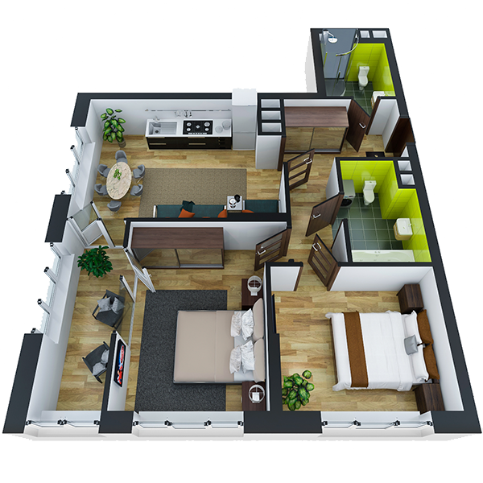

# План квартири 2c5_b

| Тип   | Загальна площа | Житлова площа |
| ----- | -------------- | ------------- |
| 2c5_b | 65.53          | 23.89         |

| Приміщення                | Площа |
| ------------------------- | ----- |
| 1.Кімната                 | 13.36 |
| 2.Кімната                 | 10.53 |
| 3.Кухня-вітальня          | 18.06 |
| 4.Ванна кімната           | 4.52  |
| 5.Санвузол                | 3.92  |
| 6.Коридор                 | 9.34  |
| 7.Засклена лоджія (k=1.0) | 5.80  |

## 📁[План приміщення](plan.pdf)

## 📁[План поверху](floor.pdf)