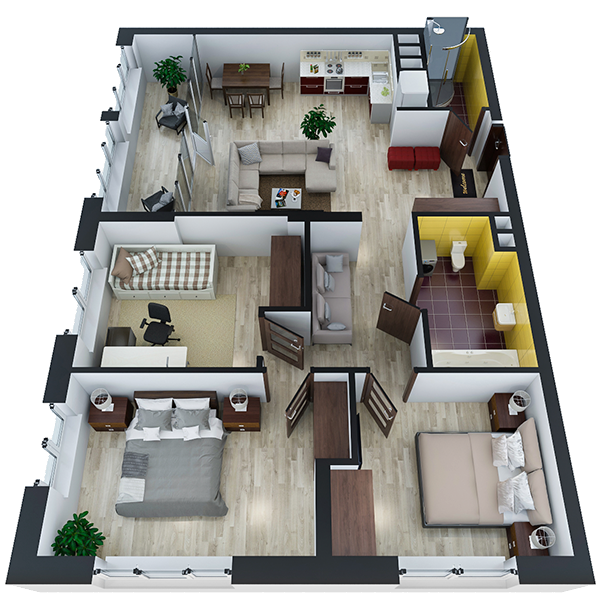

# План квартири 3c1_a

| Тип   | Загальна площа | Житлова площа |
| ----- | -------------- | ------------- |
| 3c1_a | 90.33          | 36.06         |

| Приміщення                | Площа |
| ------------------------- | ----- |
| 1.Кімната                 | 10.30 |
| 2.Кімната                 | 13.65 |
| 3.Кімната                 | 12.11 |
| 4.Кухня-вітальня          | 23.89 |
| 5.Ванна кімната           | 5.65  |
| 6.Санвузол                | 2.94  |
| 7.Передпокій              | 6.95  |
| 8.Коридор                 | 7.58  |
| 9.Засклена лоджія (k=1.0) | 7.26  |

## План приміщення

<iframe src="plan.pdf" width="100%" height="620" style="border:none;"></iframe>

[⬇ Завантажити план приміщення](plan.pdf){ .md-button }

## План поверху

<iframe src="floor.pdf" width="100%" height="620" style="border:none;"></iframe>

[⬇ Завантажити план поверху](floor.pdf){ .md-button }