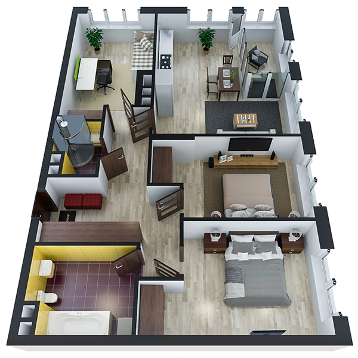

# План квартири 3c2_b

| Тип   | Загальна площа | Житлова площа |
| ----- | -------------- | ------------- |
| 3c2_b | 89.63          | 39.51         |

| Приміщення                | Площа |
| ------------------------- | ----- |
| 1.Кімната                 | 14.01 |
| 2.Кімната                 | 12.46 |
| 3.Кімната                 | 13.51 |
| 4.Кухня-вітальня          | 23.84 |
| 5.Ванна кімната           | 6.35  |
| 6.Санвузол                | 2.55  |
| 7.Коридор                 | 13.28 |
| 8.Засклена лоджія (k=1.0) | 3.63  |

## 📁[План приміщення](plan.pdf)

## 📁[План поверху](floor.pdf)