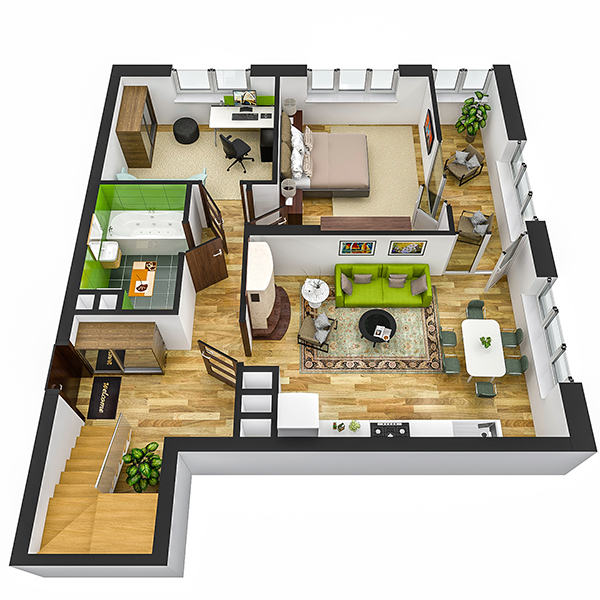

# План квартири 4c2_a

| Тип   | Загальна площа | Житлова площа |
| ----- | -------------- | ------------- |
| 4c2_a | 121.36         | 49.79         |

| Приміщення                | Площа |
| ------------------------- | ----- |
| 1.Кімната                 | 14.68 |
| 2.Кімната                 | 10.43 |
| 3.Кухня-вітальня          | 20.80 |
| 4.Ванна кімната           | 4.72  |
| 5.Передпокій              | 13.22 |
| 6.Засклена лоджія (k=1.0) | 5.87  |

## План приміщення

<iframe src="plan.pdf" width="100%" height="620" style="border:none;"></iframe>

[⬇ Завантажити план приміщення](plan.pdf){ .md-button }

## План поверху

<iframe src="floor.pdf" width="100%" height="620" style="border:none;"></iframe>

[⬇ Завантажити план поверху](floor.pdf){ .md-button }