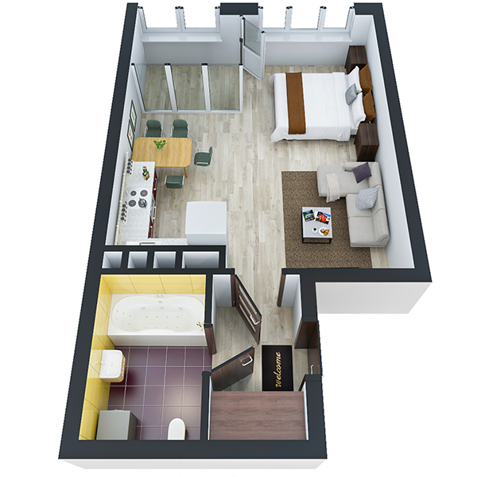

# План квартири 1k3_b

| Тип   | Загальна площа | Житлова площа |
| ----- | -------------- | ------------- |
| 1k3_b | 36.96          | 17.41         |

| Приміщення                | Площа |
| ------------------------- | ----- |
| 1.Кімната                 | 17.41 |
| 2.Кухня                   | 8.77  |
| 3.Ванна кімната           | 4.21  |
| 4.Коридор                 | 3.51  |
| 5.Засклена лоджія (k=1.0) | 3.06  |

## План приміщення

<iframe src="plan.pdf" width="100%" height="620" style="border:none;"></iframe>

[⬇ Завантажити план приміщення](plan.pdf){ .md-button }

## План поверху

<iframe src="floor.pdf" width="100%" height="620" style="border:none;"></iframe>

[⬇ Завантажити план поверху](floor.pdf){ .md-button }