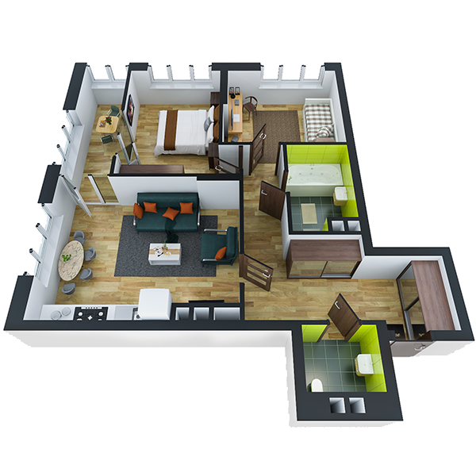

# План квартири 2c4_b

| Тип   | Загальна площа | Житлова площа |
| ----- | -------------- | ------------- |
| 2c4_b | 69.75          | 23.42         |

| Приміщення                | Площа |
| ------------------------- | ----- |
| 1.Кімната                 | 12.67 |
| 2.Кімната                 | 10.75 |
| 3.Кухня-вітальня          | 19.68 |
| 4.Ванна кімната           | 4.67  |
| 5.Санвузол                | 2.44  |
| 6.Коридор                 | 13.85 |
| 7.Засклена лоджія (k=1.0) | 5.69  |

## 📁[План приміщення](plan.pdf)

## 📁[План поверху](floor.pdf)