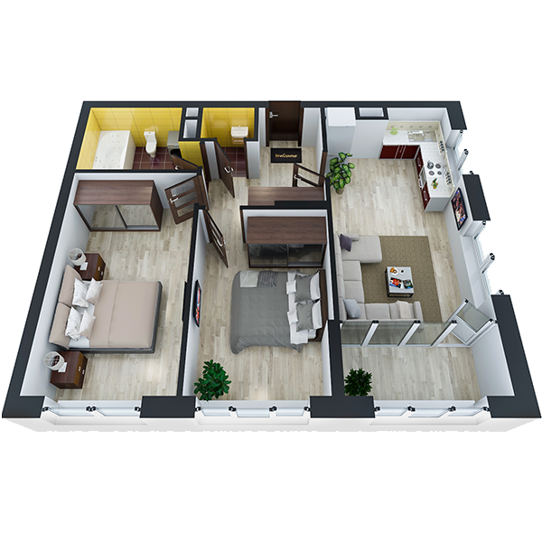

# План квартири 2c6_b

| Тип   | Загальна площа | Житлова площа |
| ----- | -------------- | ------------- |
| 2c6_b | 62.06          | 26.78         |

| Приміщення                | Площа |
| ------------------------- | ----- |
| 1.Кімната                 | 14.98 |
| 2.Кімната                 | 11.80 |
| 3.Кухня-вітальня          | 17.32 |
| 4.Ванна кімната           | 5.14  |
| 5.Санвузол                | 1.33  |
| 6.Коридор                 | 7.16  |
| 7.Засклена лоджія (k=1.0) | 4.33  |

## 📁[План приміщення](plan.pdf)

## 📁[План поверху](floor.pdf)