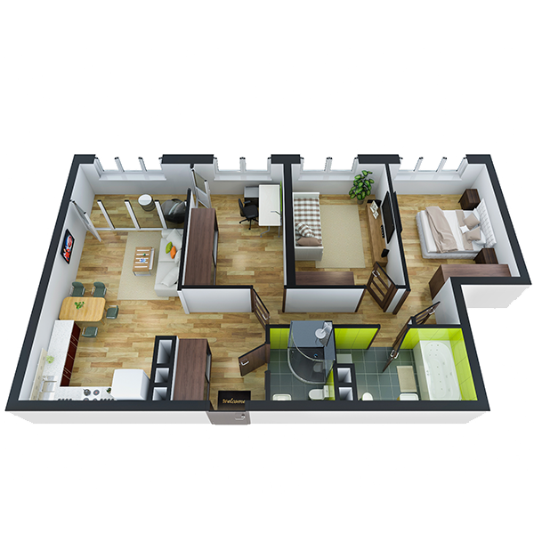

# План квартири 3c2_a

| Тип   | Загальна площа | Житлова площа |
| ----- | -------------- | ------------- |
| 3c2_a | 79.78          | 37.68         |

| Приміщення                | Площа |
| ------------------------- | ----- |
| 1.Кімната                 | 13.47 |
| 2.Кімната                 | 12.30 |
| 3.Кімната                 | 11.91 |
| 4.Кухня-вітальня          | 19.17 |
| 5.Ванна кімната           | 5.36  |
| 6.Санвузол                | 2.71  |
| 7.Коридор                 | 10.12 |
| 8.Засклена лоджія (k=1.0) | 4.74  |

## 📁[План приміщення](plan.pdf)

## 📁[План поверху](floor.pdf)