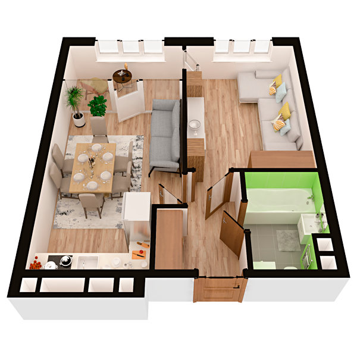

# План квартири 1c3

| Тип | Загальна площа | Житлова площа |
| --- | -------------- | ------------- |
| 1c3 | 46,77          | 14,72         |

| Приміщення                | Площа |
| ------------------------- | ----- |
| 1.Кімната                 | 14,72 |
| 2.Кухня-вітальня          | 18,53 |
| 3.Ванна кімната           | 4,31  |
| 4.Коридор                 | 4,46  |
| 5.Засклена лоджія (k=1,0) | 4,75  |

## План приміщення

<iframe src="plan.pdf" width="100%" height="620" style="border:none;"></iframe>

[⬇ Завантажити план приміщення](plan.pdf){ .md-button }

## План поверху

<iframe src="floor.pdf" width="100%" height="620" style="border:none;"></iframe>

[⬇ Завантажити план поверху](floor.pdf){ .md-button }