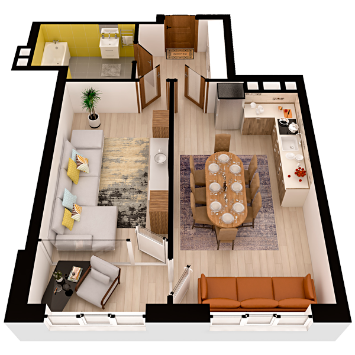

# План квартири 1c4

| Тип | Загальна площа | Житлова площа |
| --- | -------------- | ------------- |
| 1c4 | 51,42          | 14,01         |

| Приміщення                | Площа |
| ------------------------- | ----- |
| 1.Кімната                 | 14,01 |
| 2.Кухня-вітальня          | 20,97 |
| 3.Ванна кімната           | 6,12  |
| 4.Коридор                 | 6,32  |
| 5.Засклена лоджія (k=1,0) | 4,00  |

## План приміщення

<iframe src="plan.pdf" width="100%" height="620" style="border:none;"></iframe>

[⬇ Завантажити план приміщення](plan.pdf){ .md-button }

## План поверху

<iframe src="floor.pdf" width="100%" height="620" style="border:none;"></iframe>

[⬇ Завантажити план поверху](floor.pdf){ .md-button }