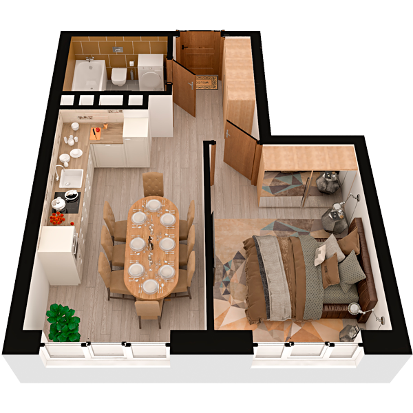

# План квартири 1k2

| Тип | Загальна площа | Житлова площа |
| --- | -------------- | ------------- |
| 1k2 | 35,83          | 11,53         |

| Приміщення      | Площа |
| --------------- | ----- |
| 1.Кімната       | 11,53 |
| 2.Кухня         | 15,06 |
| 3.Ванна кімната | 3,98  |
| 4.Коридор       | 5,26  |

## План приміщення

<iframe src="plan.pdf" width="100%" height="620" style="border:none;"></iframe>

[⬇ Завантажити план приміщення](plan.pdf){ .md-button }

## План поверху

<iframe src="floor.pdf" width="100%" height="620" style="border:none;"></iframe>

[⬇ Завантажити план поверху](floor.pdf){ .md-button }