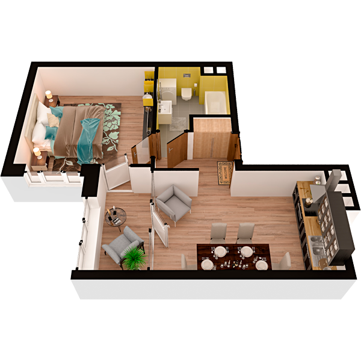

# План квартири 1k4

| Тип | Загальна площа | Житлова площа |
| --- | -------------- | ------------- |
| 1k4 | 41,93          | 15,33         |

| Приміщення                | Площа |
| ------------------------- | ----- |
| 1.Кімната                 | 15,33 |
| 2.Кухня                   | 13,76 |
| 3.Ванна кімната           | 4,89  |
| 4.Коридор                 | 3,65  |
| 5.Засклена лоджія (k=1,0) | 4,30  |

## 📁[План приміщення](plan.pdf)

## 📁[План поверху](floor.pdf)