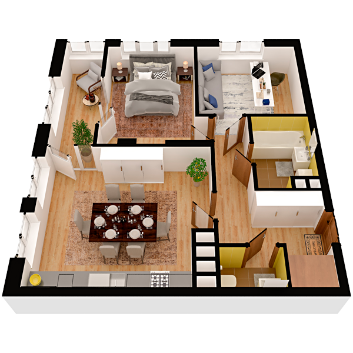

# План квартири 2c1

| Тип | Загальна площа | Житлова площа |
| --- | -------------- | ------------- |
| 2c1 | 68,38          | 24,69         |

| Приміщення                | Площа |
| ------------------------- | ----- |
| 1.Кімната                 | 13,73 |
| 2.Кімната                 | 10,96 |
| 3.Кухня-вітальня          | 21,52 |
| 4.Ванна кімната           | 4,55  |
| 5.Санвузол                | 1,88  |
| 6.Гардеробна              | 1,49  |
| 7.Коридор                 | 8,15  |
| 8.Засклена лоджія (k=1,0) | 6,10  |

## 📁[План приміщення](plan.pdf)

## 📁[План поверху](floor.pdf)