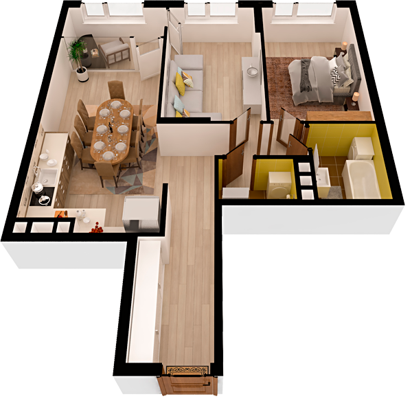

# План квартири 2c2

| Тип | Загальна площа | Житлова площа |
| --- | -------------- | ------------- |
| 2c2 | 74,62          | 28,23         |

| Приміщення                | Площа |
| ------------------------- | ----- |
| 1.Кімната                 | 13,96 |
| 2.Кімната                 | 14,27 |
| 3.Кухня-вітальня          | 22,32 |
| 4.Ванна кімната           | 4,53  |
| 5.Санвузол                | 2,41  |
| 6.Передпокій              | 7,62  |
| 7.Коридор                 | 5,09  |
| 8.Засклена лоджія (k=1,0) | 4,42  |

## 📁[План приміщення](plan.pdf)

## 📁[План поверху](floor.pdf)