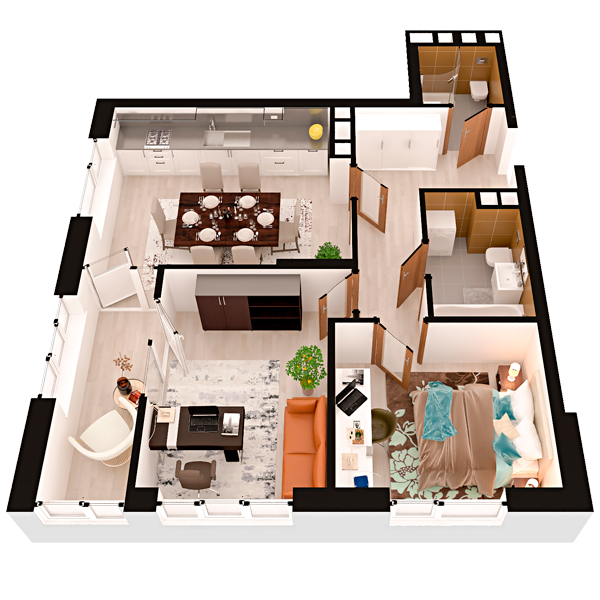

# План квартири 2c3

| Тип | Загальна площа | Житлова площа |
| --- | -------------- | ------------- |
| 2c3 | 67,04          | 23,50         |

| Приміщення                | Площа |
| ------------------------- | ----- |
| 1.Кімната                 | 12,85 |
| 2.Кімната                 | 10,65 |
| 3.Кухня-вітальня          | 19,37 |
| 4.Ванна кімната           | 4,79  |
| 5.Санвузол                | 3,08  |
| 6.Коридор                 | 10,48 |
| 7.Засклена лоджія (k=1,0) | 5,82  |

## План приміщення

<iframe src="plan.pdf" width="100%" height="620" style="border:none;"></iframe>

[⬇ Завантажити план приміщення](plan.pdf){ .md-button }

## План поверху

<iframe src="floor.pdf" width="100%" height="620" style="border:none;"></iframe>

[⬇ Завантажити план поверху](floor.pdf){ .md-button }