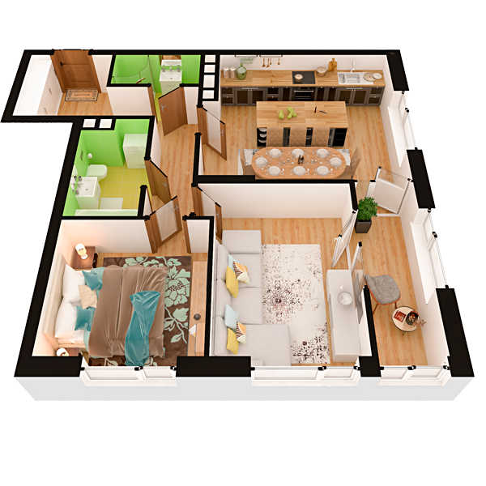

# План квартири 2c4

| Тип | Загальна площа | Житлова площа |
| --- | -------------- | ------------- |
| 2c4 | 72,95          | 25,21         |

| Приміщення                | Площа |
| ------------------------- | ----- |
| 1.Кімната                 | 14,27 |
| 2.Кімната                 | 10,94 |
| 3.Кухня-вітальня          | 22,21 |
| 4.Ванна кімната           | 4,92  |
| 5.Санвузол                | 2,84  |
| 6.Коридор                 | 11,71 |
| 7.Засклена лоджія (k=1,0) | 6,06  |

## 📁[План приміщення](plan.pdf)

## 📁[План поверху](floor.pdf)