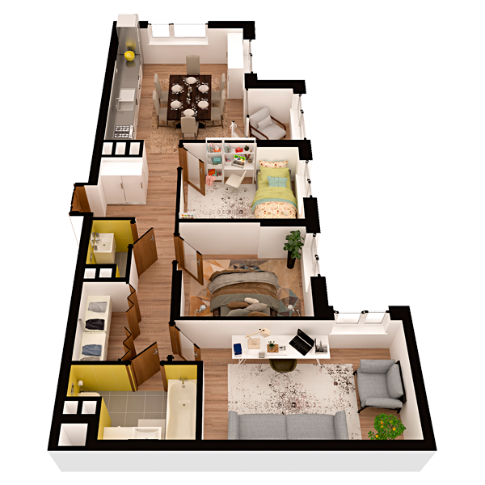

# План квартири 3c1

| Тип | Загальна площа | Житлова площа |
| --- | -------------- | ------------- |
| 3c1 | 83,53          | 35,89         |

| Приміщення                | Площа |
| ------------------------- | ----- |
| 1.Кімната                 | 10,01 |
| 2.Кімната                 | 10,09 |
| 3.Кімната                 | 15,79 |
| 4.Кухня-вітальня          | 23,93 |
| 5.Ванна кімната           | 4,63  |
| 6.Санвузол                | 1,72  |
| 7.Гардеробна              | 2,73  |
| 8.Коридор                 | 11,24 |
| 9.Засклена лоджія (k=1,0) | 3,39  |

## 📁[План приміщення](plan.pdf)

## 📁[План поверху](floor.pdf)