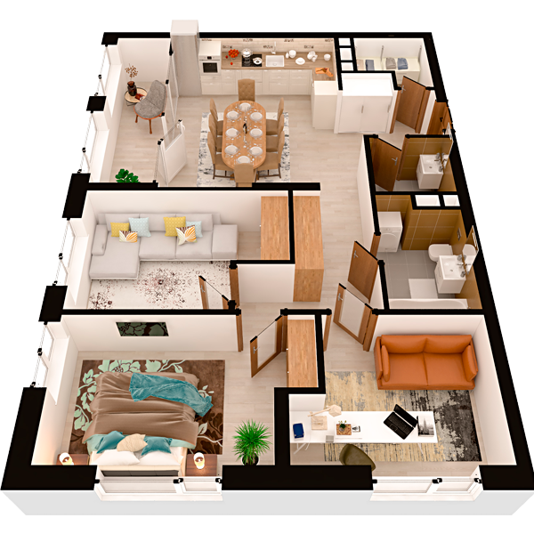

# План квартири 3c2

| Тип | Загальна площа | Житлова площа |
| --- | -------------- | ------------- |
| 3c2 | 89,46          | 36,20         |

| Приміщення                 | Площа |
| -------------------------- | ----- |
| 1.Кімната                  | 12,41 |
| 2.Кімната                  | 13,55 |
| 3.Кімната                  | 10,24 |
| 4.Кухня-вітальня           | 21,79 |
| 5.Ванна кімната            | 4,93  |
| 6.Санвузол                 | 2,98  |
| 7.Гардеробна               | 3,06  |
| 8.Передпокій               | 6,60  |
| 9.Коридор                  | 6,64  |
| 10.Засклена лоджія (k=1,0) | 7,26  |

## План приміщення

<iframe src="plan.pdf" width="100%" height="620" style="border:none;"></iframe>

[⬇ Завантажити план приміщення](plan.pdf){ .md-button }

## План поверху

<iframe src="floor.pdf" width="100%" height="620" style="border:none;"></iframe>

[⬇ Завантажити план поверху](floor.pdf){ .md-button }