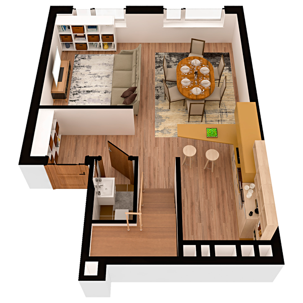

# План квартири 4c1

| Тип | Загальна площа | Житлова площа |
| --- | -------------- | ------------- |
| 4c1 | 132,62         | 67,62         |

| Приміщення       | Площа |
| ---------------- | ----- |
| 1.Кімната        | 10,10 |
| 2.Кухня-вітальня | 23,94 |
| 3.Санвузол       | 1,65  |
| 4.Передпокій     | 9,30  |

## План приміщення

<iframe src="plan.pdf" width="100%" height="620" style="border:none;"></iframe>

[⬇ Завантажити план приміщення](plan.pdf){ .md-button }

## План поверху

<iframe src="floor.pdf" width="100%" height="620" style="border:none;"></iframe>

[⬇ Завантажити план поверху](floor.pdf){ .md-button }