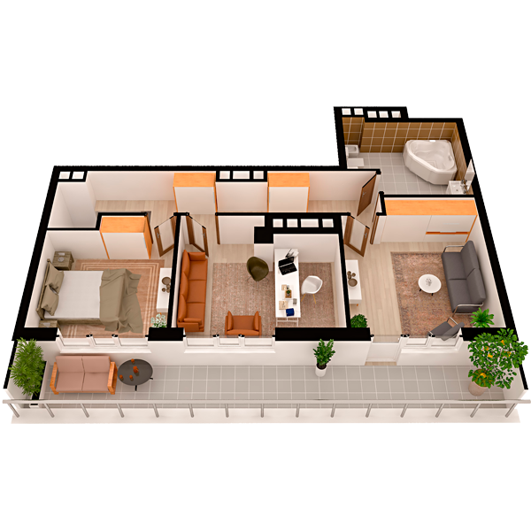

# План квартири 4k2

| Тип | Загальна площа | Житлова площа |
| --- | -------------- | ------------- |
| 4k2 | 115,37         | 65,41         |

| Приміщення   | Площа |
| ------------ | ----- |
| 1.Кімната    | 19,84 |
| 2.Кухня      | 11,42 |
| 3.Санвузол   | 2,22  |
| 4.Гардеробна | 2,51  |
| 5.Передпокій | 7,23  |

## 📁[План приміщення](plan.pdf)

## 📁[План поверху](floor.pdf)