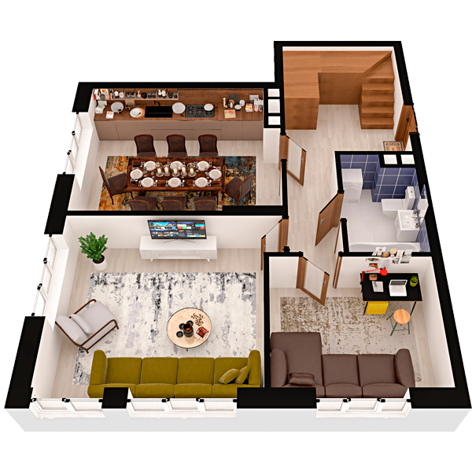

# План квартири 5C2

| Тип | Загальна площа | Житлова площа |
| --- | -------------- | ------------- |
| 5C2 | 120,19         | 64,04         |

| Приміщення       | Площа |
| ---------------- | ----- |
| 1.Кімната        | 19,03 |
| 2.Кімната        | 10,65 |
| 3.Кухня-вітальня | 19,37 |
| 4.Ванна кімната  | 4,79  |
| 5.Передпокій     | 15,68 |

## 📁[План приміщення](plan.pdf)

## 📁[План поверху](floor.pdf)