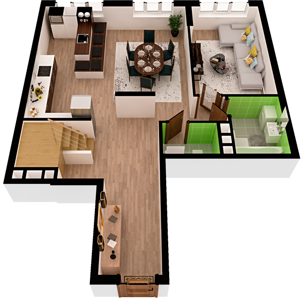

# План квартири 5c1

| Тип | Загальна площа | Житлова площа |
| --- | -------------- | ------------- |
| 5c1 | 133,69         | 65,58         |

| Приміщення       | Площа |
| ---------------- | ----- |
| 1.Кімната        | 15,89 |
| 2.Кімната        | 14,77 |
| 3.Кухня-вітальня | 17,17 |
| 4.Ванна кімната  | 4,53  |
| 5.Санвузол       | 2,41  |
| 6.Гардеробна     | 2,50  |
| 7.Передпокій     | 18,12 |

## План приміщення

<iframe src="plan.pdf" width="100%" height="620" style="border:none;"></iframe>

[⬇ Завантажити план приміщення](plan.pdf){ .md-button }

## План поверху

<iframe src="floor.pdf" width="100%" height="620" style="border:none;"></iframe>

[⬇ Завантажити план поверху](floor.pdf){ .md-button }