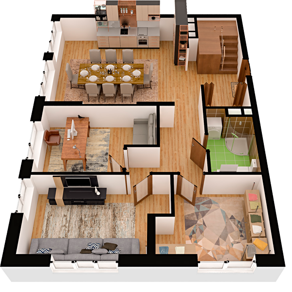

# План квартири 6c1

| Тип | Загальна площа | Житлова площа |
| --- | -------------- | ------------- |
| 6c1 | 158,27         | 79,02         |

| Приміщення       | Площа |
| ---------------- | ----- |
| 1.Кімната        | 12,41 |
| 2.Кімната        | 13,49 |
| 3.Кімната        | 10,24 |
| 4.Кухня-вітальня | 29,65 |
| 5.Санвузол       | 4,93  |
| 6.Гардеробна     | 2,13  |
| 7.Коридор        | 6,64  |
| 8.Передпокій     | 11,07 |

## 📁[План приміщення](plan.pdf)

## 📁[План поверху](floor.pdf)