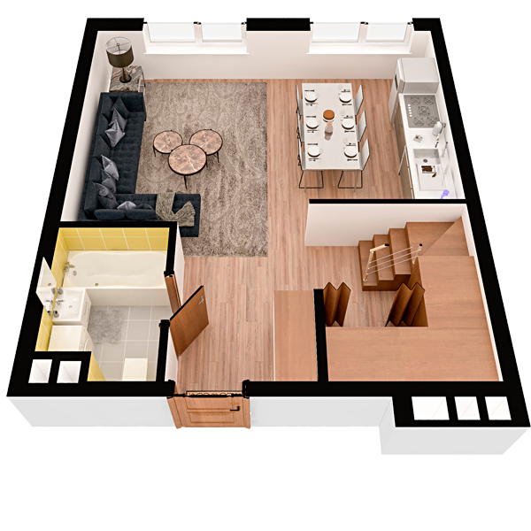

# План квартири 6k1

| Тип | Загальна площа | Житлова площа |
| --- | -------------- | ------------- |
| 6k1 | 153,86         | 79,02         |

| Приміщення      | Площа |
| --------------- | ----- |
| 1.Кімната       | 18,83 |
| 2.Кухня         | 10,31 |
| 3.Ванна кімната | 4,30  |
| 4.Гардеробна    | 3,69  |
| 5.Передпокій    | 10,50 |

## План приміщення

<iframe src="plan.pdf" width="100%" height="620" style="border:none;"></iframe>

[⬇ Завантажити план приміщення](plan.pdf){ .md-button }

## План поверху

<iframe src="floor.pdf" width="100%" height="620" style="border:none;"></iframe>

[⬇ Завантажити план поверху](floor.pdf){ .md-button }