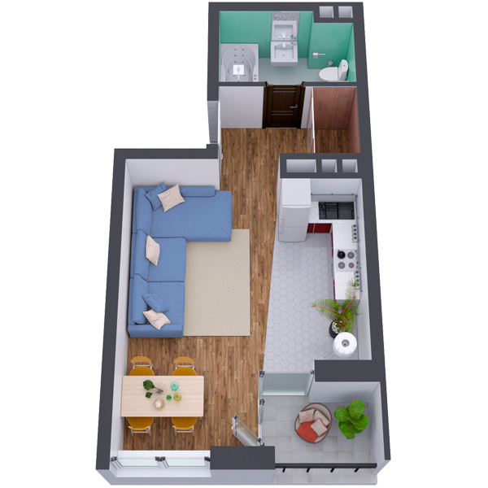

# План квартири 1k2_3b

| Тип    | Загальна площа | Житлова площа |
| ------ | -------------- | ------------- |
| 1k2_3b | 35.02          | 16.87         |

| Приміщення       | Площа |
| ---------------- | ----- |
| 1.Кімната        | 16.87 |
| 2.Кухня          | 7.06  |
| 3.Ванна кімната  | 4.94  |
| 4.Гардеробна     | 1.68  |
| 5.Коридор        | 3.05  |
| 6.Лоджія (k=0.5) | 1.42  |

## 📁[План приміщення](plan.pdf)

## 📁[План поверху](floor.pdf)