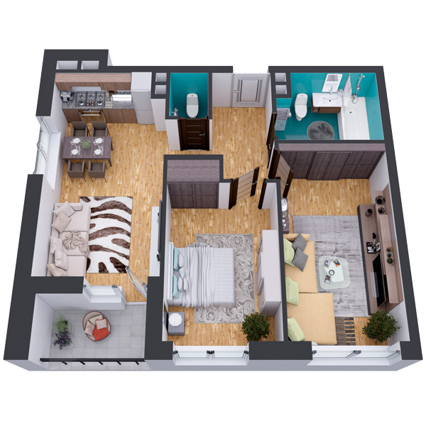

# План квартири 2c2_3a

| Тип    | Загальна площа | Житлова площа |
| ------ | -------------- | ------------- |
| 2c2_3a | 63.86          | 28.50         |

| Приміщення       | Площа |
| ---------------- | ----- |
| 1.Кімната        | 15.56 |
| 2.Кімната        | 12.94 |
| 3.Кухня-вітальня | 18.90 |
| 4.Ванна кімната  | 6.00  |
| 5.Санвузол       | 1.53  |
| 6.Коридор        | 6.92  |
| 7.Лоджія (k=0.5) | 2.01  |

## План приміщення

<iframe src="plan.pdf" width="100%" height="620" style="border:none;"></iframe>

[⬇ Завантажити план приміщення](plan.pdf){ .md-button }

## План поверху

<iframe src="floor.pdf" width="100%" height="620" style="border:none;"></iframe>

[⬇ Завантажити план поверху](floor.pdf){ .md-button }