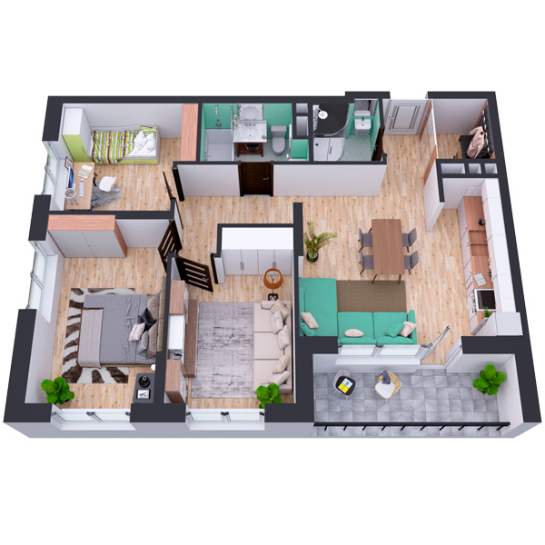

# План квартири 3c4_3b

| Тип    | Загальна площа | Житлова площа |
| ------ | -------------- | ------------- |
| 3c4_3b | 84.55          | 37.95         |

| Приміщення       | Площа |
| ---------------- | ----- |
| 1.Кімната        | 14.46 |
| 2.Кімната        | 12.42 |
| 3.Кімната        | 11.07 |
| 4.Кухня-вітальня | 19.41 |
| 5.Ванна кімната  | 4.60  |
| 6.Санвузол       | 3.33  |
| 7.Коридор        | 12.81 |
| 8.Гардеробна     | 2.97  |
| 9.Лоджія (k=0.5) | 3.48  |

## План приміщення

<iframe src="plan.pdf" width="100%" height="620" style="border:none;"></iframe>

[⬇ Завантажити план приміщення](plan.pdf){ .md-button }

## План поверху

<iframe src="floor.pdf" width="100%" height="620" style="border:none;"></iframe>

[⬇ Завантажити план поверху](floor.pdf){ .md-button }