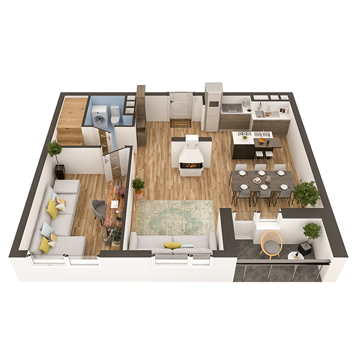

# План квартири 5c1

| Тип | Загальна площа | Житлова площа |
| --- | -------------- | ------------- |
| 5c1 | 160.30         | 89.94         |

| Приміщення       | Площа |
| ---------------- | ----- |
| 1.Кімната        | 13.68 |
| 2.Кімната        | 12.80 |
| 3.Кухня-вітальня | 19.80 |
| 4.Коридор        | 13.03 |
| 5.Санвузол       | 2.96  |
| 6.Лоджія (k=0.5) | 2.01  |

## План приміщення

<iframe src="plan.pdf" width="100%" height="620" style="border:none;"></iframe>

[⬇ Завантажити план приміщення](plan.pdf){ .md-button }

## План поверху

<iframe src="floor.pdf" width="100%" height="620" style="border:none;"></iframe>

[⬇ Завантажити план поверху](floor.pdf){ .md-button }