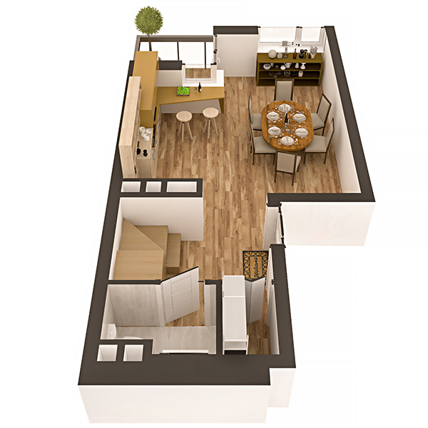

# План квартири 5k2

| Тип | Загальна площа | Житлова площа |
| --- | -------------- | ------------- |
| 5k2 | 131.13         | 81.26         |

| Приміщення       | Площа |
| ---------------- | ----- |
| 1.Кімната        | 16.83 |
| 2.Кухня          | 7.10  |
| 3.Коридор        | 5.93  |
| 4.Санвузол       | 2.35  |
| 5.Гардеробна     | 1.34  |
| 6.Лоджія (k=0,5) | 1.42  |

## План приміщення

<iframe src="plan.pdf" width="100%" height="620" style="border:none;"></iframe>

[⬇ Завантажити план приміщення](plan.pdf){ .md-button }

## План поверху

<iframe src="floor.pdf" width="100%" height="620" style="border:none;"></iframe>

[⬇ Завантажити план поверху](floor.pdf){ .md-button }