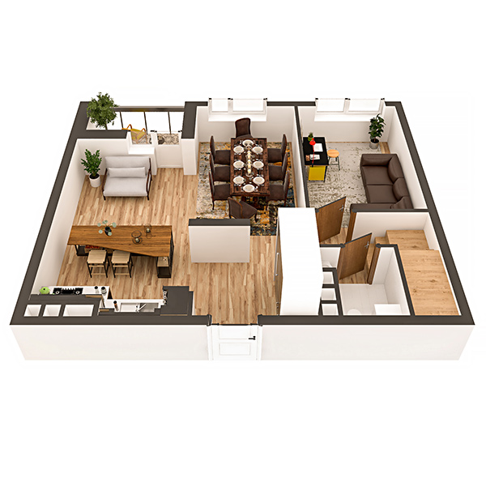

# План квартири 5с3

| Тип | Загальна площа | Житлова площа |
| --- | -------------- | ------------- |
| 5с3 | 160.30         | 89,94         |

| Приміщення       | Площа |
| ---------------- | ----- |
| 1.Кімната        | 13.68 |
| 2.Кімната        | 12.80 |
| 3.Кухня-вітальня | 19.80 |
| 4.Санвузол       | 2.96  |
| 5.Коридор        | 13.03 |
| 6.Лоджія (k=0,5) | 2.01  |

## 📁[План приміщення](plan.pdf)

## 📁[План поверху](floor.pdf)