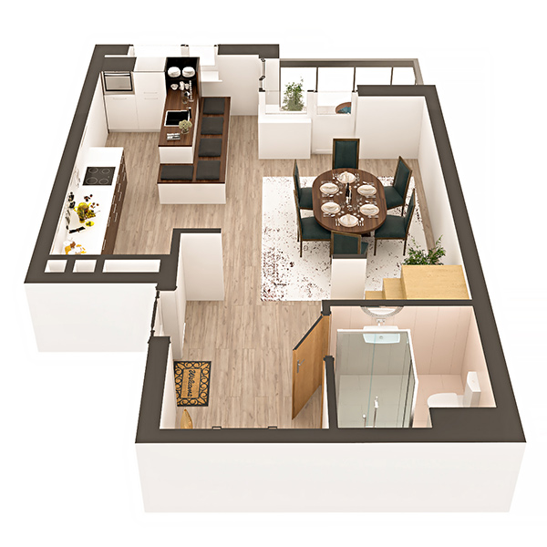

# План квартири 5с4

| Тип | Загальна площа | Житлова площа |
| --- | -------------- | ------------- |
| 5с4 | 144.12         | 82,08         |

| Приміщення       | Площа |
| ---------------- | ----- |
| 1.Кімната        | 14.93 |
| 2.Кухня-вітальня | 16.51 |
| 3.Коридор        | 9.20  |
| 4.Санвузол       | 4.03  |
| 5.Лоджія (k=0,5) | 1.91  |

## План приміщення

<iframe src="plan.pdf" width="100%" height="620" style="border:none;"></iframe>

[⬇ Завантажити план приміщення](plan.pdf){ .md-button }

## План поверху

<iframe src="floor.pdf" width="100%" height="620" style="border:none;"></iframe>

[⬇ Завантажити план поверху](floor.pdf){ .md-button }