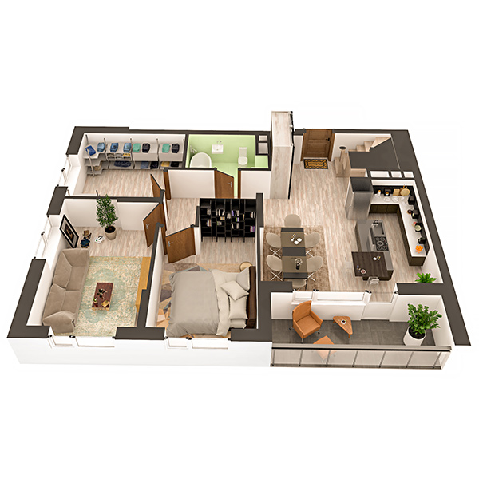

# План квартири 6с1

| Тип | Загальна площа | Житлова площа |
| --- | -------------- | ------------- |
| 6с1 | 155.53         | 81.11         |

| Приміщення       | Площа |
| ---------------- | ----- |
| 1.Кімната        | 14.46 |
| 2.Кімната        | 12.42 |
| 3.Кімната        | 11.07 |
| 4.Кухня-вітальня | 21.14 |
| 5.Ванна кімната  | 4.60  |
| 6.Коридор        | 17.05 |
| 7.Лоджія (k=0,5) | 3.40  |

## План приміщення

<iframe src="plan.pdf" width="100%" height="620" style="border:none;"></iframe>

[⬇ Завантажити план приміщення](plan.pdf){ .md-button }

## План поверху

<iframe src="floor.pdf" width="100%" height="620" style="border:none;"></iframe>

[⬇ Завантажити план поверху](floor.pdf){ .md-button }