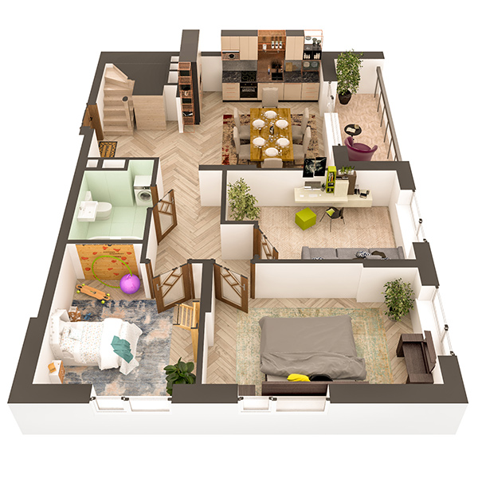

# План квартири 6с2

| Тип | Загальна площа | Житлова площа |
| --- | -------------- | ------------- |
| 6с2 | 155.53         | 81.11         |

| Приміщення       | Площа |
| ---------------- | ----- |
| 1.Кімната        | 14.46 |
| 2.Кімната        | 12.42 |
| 3.Кімната        | 11.07 |
| 4.Кухня-вітальня | 21.14 |
| 5.Ванна кімната  | 4.60  |
| 6.Передпокій     | 17.05 |
| 7.Лоджія (k=0,5) | 3.40  |

## 📁[План приміщення](plan.pdf)

## 📁[План поверху](floor.pdf)