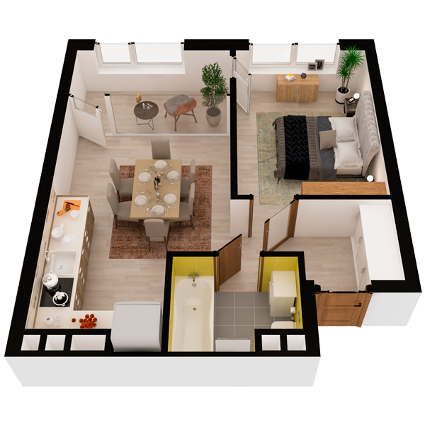

# План квартири 1c1

| Тип | Загальна площа | Житлова площа |
| --- | -------------- | ------------- |
| 1c1 | 44,88          | 12,68         |

| Приміщення                | Площа |
| ------------------------- | ----- |
| 1.Кімната                 | 12,68 |
| 2.Кухня-вітальня          | 17,60 |
| 3.Ванна кімната           | 3,94  |
| 4.Коридор                 | 5,70  |
| 5.Засклена лоджія (k=1,0) | 4,96  |

## План приміщення

<iframe src="plan.pdf" width="100%" height="620" style="border:none;"></iframe>

[⬇ Завантажити план приміщення](plan.pdf){ .md-button }

## План поверху

<iframe src="floor.pdf" width="100%" height="620" style="border:none;"></iframe>

[⬇ Завантажити план поверху](floor.pdf){ .md-button }