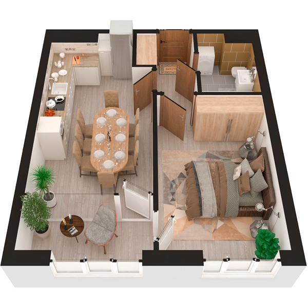

# План квартири 1c2

| Тип | Загальна площа | Житлова площа |
| --- | -------------- | ------------- |
| 1c2 | 42,79          | 14,04         |

| Приміщення                | Площа |
| ------------------------- | ----- |
| 1.Кімната                 | 12,68 |
| 2.Кухня-вітальня          | 17,60 |
| 3.Ванна кімната           | 3,94  |
| 4.Коридор                 | 5,70  |
| 5.Засклена лоджія (k=1,0) | 4,96  |

## 📁[План приміщення](plan.pdf)

## 📁[План поверху](floor.pdf)