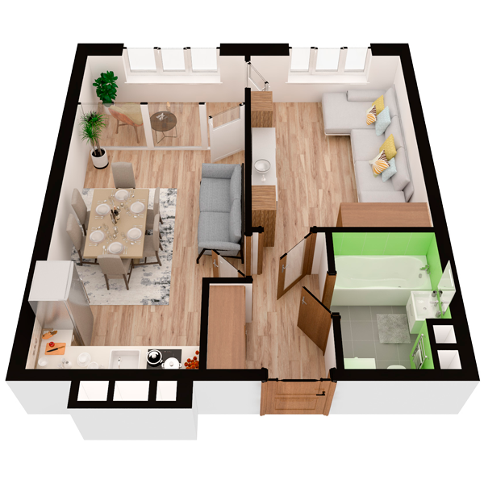

# План квартири 1c6

| Тип | Загальна площа | Житлова площа |
| --- | -------------- | ------------- |
| 1c6 | 47,13          | 15,52         |

| Приміщення                | Площа |
| ------------------------- | ----- |
| 1.Кімната                 | 15,52 |
| 2.Кухня-вітальня          | 18,04 |
| 3.Ванна кімната           | 4,32  |
| 4.Коридор                 | 4,77  |
| 5.Засклена лоджія (k=1,0) | 4,48  |

## 📁[План приміщення](plan.pdf)

## 📁[План поверху](floor.pdf)