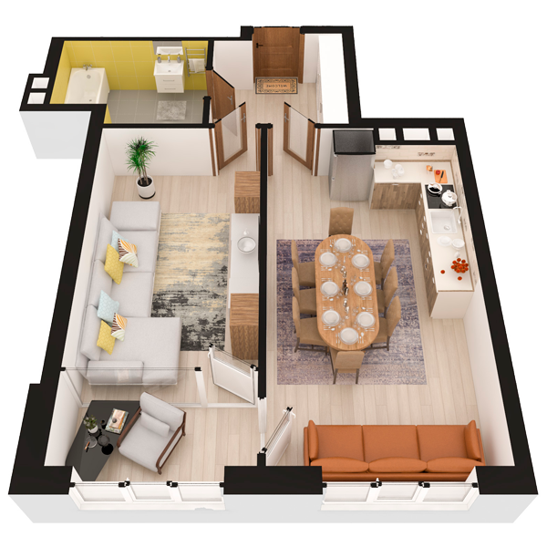

# План квартири 1c7

| Тип | Загальна площа | Житлова площа |
| --- | -------------- | ------------- |
| 1c7 | 53,87          | 15,28         |

| Приміщення                | Площа |
| ------------------------- | ----- |
| 1.Кімната                 | 15,28 |
| 2.Кухня-вітальня          | 21,14 |
| 3.Ванна кімната           | 6,46  |
| 4.Коридор                 | 6,62  |
| 5.Засклена лоджія (k=1,0) | 4,37  |

## 📁[План приміщення](plan.pdf)

## 📁[План поверху](floor.pdf)