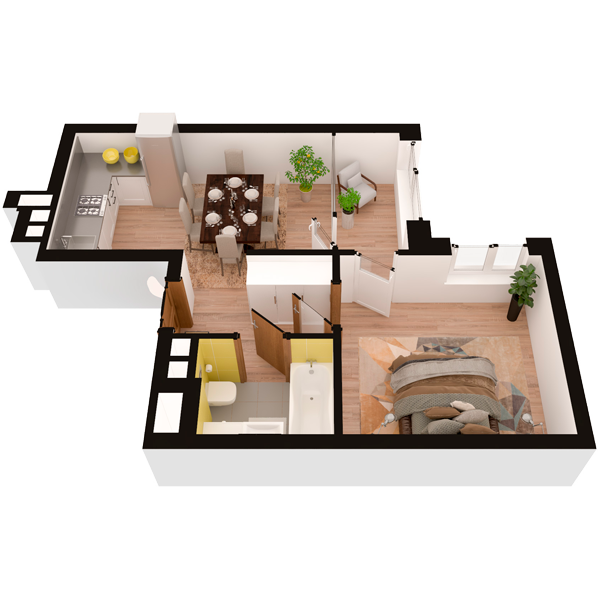

# План квартири 1k1

| Тип | Загальна площа | Житлова площа |
| --- | -------------- | ------------- |
| 1k1 | 38,26          | 12,00         |

| Приміщення                | Площа |
| ------------------------- | ----- |
| 1.Кімната                 | 12,00 |
| 2.Кухня-вітальня          | 14,79 |
| 3.Ванна кімната           | 3,58  |
| 4.Коридор                 | 4,24  |
| 5.Засклена лоджія (k=1,0) | 3,65  |

## 📁[План приміщення](plan.pdf)

## 📁[План поверху](floor.pdf)