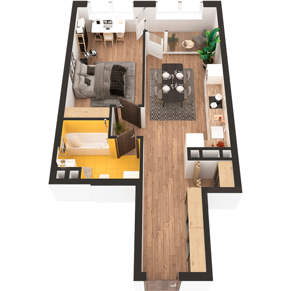

# План квартири 1k2

| Тип | Загальна площа | Житлова площа |
| --- | -------------- | ------------- |
| 1k2 | 54,70          | 16,31         |

| Приміщення                | Площа |
| ------------------------- | ----- |
| 1.Кімната                 | 16,31 |
| 2.Кухня-вітальня          | 16,10 |
| 3.Ванна кімната           | 5,55  |
| 4.Коридор                 | 11,25 |
| 5.Комора                  | 1,14  |
| 6.Засклена лоджія (k=1,0) | 4,35  |

## 📁[План приміщення](plan.pdf)

## 📁[План поверху](floor.pdf)