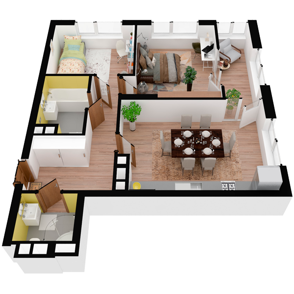

# План квартири 2c1

| Тип | Загальна площа | Житлова площа |
| --- | -------------- | ------------- |
| 2c1 | 69,62          | 25,11         |

| Приміщення                | Площа |
| ------------------------- | ----- |
| 1.Кімната                 | 14,68 |
| 2.Кімната                 | 10,43 |
| 3.Кухня-вітальня          | 20,96 |
| 4.Ванна кімната           | 4,72  |
| 5.Санвузол                | 3,10  |
| 6.Коридор                 | 9,87  |
| 7.Засклена лоджія (k=1,0) | 5,86  |

## План приміщення

<iframe src="plan.pdf" width="100%" height="620" style="border:none;"></iframe>

[⬇ Завантажити план приміщення](plan.pdf){ .md-button }

## План поверху

<iframe src="floor.pdf" width="100%" height="620" style="border:none;"></iframe>

[⬇ Завантажити план поверху](floor.pdf){ .md-button }