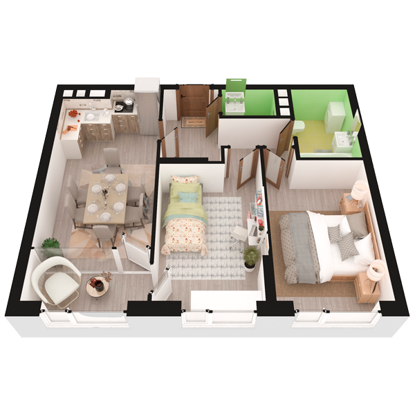

# План квартири 2c2

| Тип | Загальна площа | Житлова площа |
| --- | -------------- | ------------- |
| 2c2 | 62,00          | 26,38         |

| Приміщення                | Площа |
| ------------------------- | ----- |
| 1.Кімната                 | 13,08 |
| 2.Кімната                 | 13,30 |
| 3.Кухня-вітальня          | 16,91 |
| 4.Ванна кімната           | 5,08  |
| 5.Санвузол                | 1,88  |
| 6.Коридор                 | 7,58  |
| 7.Засклена лоджія (k=1,0) | 4,17  |

## План приміщення

<iframe src="plan.pdf" width="100%" height="620" style="border:none;"></iframe>

[⬇ Завантажити план приміщення](plan.pdf){ .md-button }

## План поверху

<iframe src="floor.pdf" width="100%" height="620" style="border:none;"></iframe>

[⬇ Завантажити план поверху](floor.pdf){ .md-button }