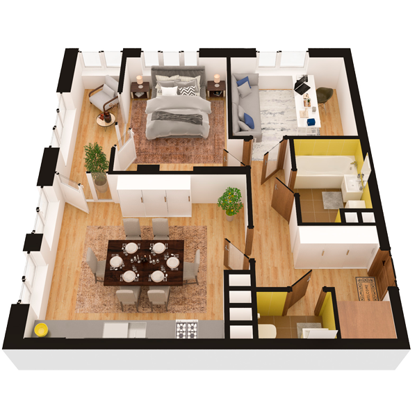

# План квартири 2c3

| Тип | Загальна площа | Житлова площа |
| --- | -------------- | ------------- |
| 2c3 | 69,09          | 25,09         |

| Приміщення                | Площа |
| ------------------------- | ----- |
| 1.Кімната                 | 13,96 |
| 2.Кімната                 | 11,13 |
| 3.Кухня-вітальня          | 22,38 |
| 4.Ванна кімната           | 4,51  |
| 5.Санвузол                | 1,78  |
| 6.Коридор                 | 7,49  |
| 7.Гардеробна              | 1,78  |
| 8.Засклена лоджія (k=1,0) | 6,06  |

## 📁[План приміщення](plan.pdf)

## 📁[План поверху](floor.pdf)