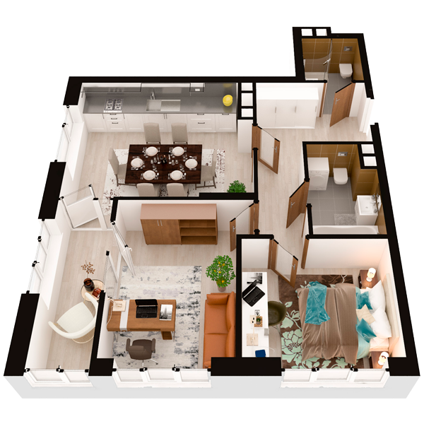

# План квартири 2c4

| Тип | Загальна площа | Житлова площа |
| --- | -------------- | ------------- |
| 2c4 | 65,77          | 23,83         |

| Приміщення                | Площа |
| ------------------------- | ----- |
| 1.Кімната                 | 13,36 |
| 2.Кімната                 | 10,47 |
| 3.Кухня-вітальня          | 18,23 |
| 4.Ванна кімната           | 4,48  |
| 5.Санвузол                | 4,10  |
| 6.Коридор                 | 9,34  |
| 7.Засклена лоджія (k=1,0) | 5,79  |

## 📁[План приміщення](plan.pdf)

## 📁[План поверху](floor.pdf)