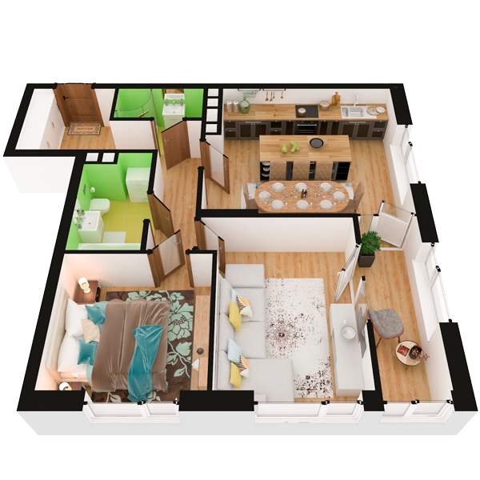

# План квартири 2c5

| Тип | Загальна площа | Житлова площа |
| --- | -------------- | ------------- |
| 2c5 | 71,37          | 24,32         |

| Приміщення                | Площа |
| ------------------------- | ----- |
| 1.Кімната                 | 13,67 |
| 2.Кімната                 | 10,65 |
| 3.Кухня-вітальня          | 21,57 |
| 4.Ванна кімната           | 5,00  |
| 5.Санвузол                | 1,61  |
| 6.Передпокій              | 8,97  |
| 7.Коридор                 | 3,84  |
| 8.Засклена лоджія (k=1,0) | 6,06  |

## 📁[План приміщення](plan.pdf)

## 📁[План поверху](floor.pdf)