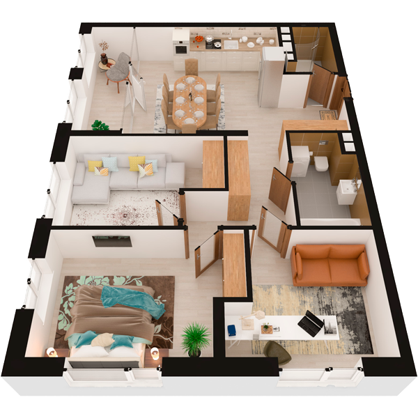

# План квартири 3c1

| Тип | Загальна площа | Житлова площа |
| --- | -------------- | ------------- |
| 3c1 | 90,40          | 38,67         |

| Приміщення                | Площа |
| ------------------------- | ----- |
| 1.Кімната                 | 11,28 |
| 2.Кімната                 | 15,12 |
| 3.Кімната                 | 12,27 |
| 4.Кухня-вітальня          | 23,34 |
| 5.Ванна кімната           | 5,62  |
| 6.Санвузол                | 3,11  |
| 7.Передпокій              | 5,73  |
| 8.Коридор                 | 7,09  |
| 9.Засклена лоджія (k=1,0) | 6,84  |

## План приміщення

<iframe src="plan.pdf" width="100%" height="620" style="border:none;"></iframe>

[⬇ Завантажити план приміщення](plan.pdf){ .md-button }

## План поверху

<iframe src="floor.pdf" width="100%" height="620" style="border:none;"></iframe>

[⬇ Завантажити план поверху](floor.pdf){ .md-button }