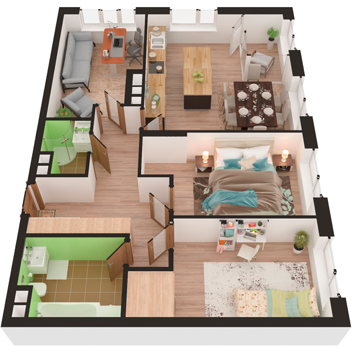

# План квартири 3c2

| Тип | Загальна площа | Житлова площа |
| --- | -------------- | ------------- |
| 3c2 | 89,49          | 39,92         |

| Приміщення                | Площа |
| ------------------------- | ----- |
| 1.Кімната                 | 13,95 |
| 2.Кімната                 | 13,07 |
| 3.Кімната                 | 12,90 |
| 4.Кухня-вітальня          | 23,77 |
| 5.Ванна кімната           | 6,35  |
| 6.Санвузол                | 2,61  |
| 7.Передпокій              | 8,90  |
| 8.Коридор                 | 4,30  |
| 9.Засклена лоджія (k=1,0) | 3,64  |

## 📁[План приміщення](plan.pdf)

## 📁[План поверху](floor.pdf)