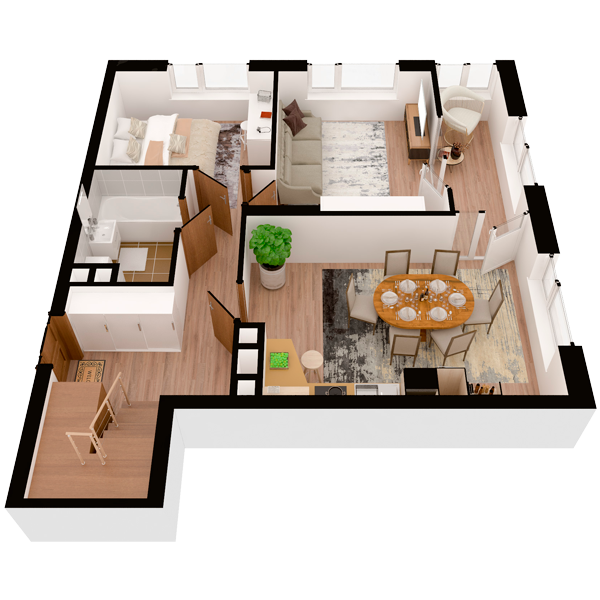

# План квартири 4c1

| Тип | Загальна площа | Житлова площа |
| --- | -------------- | ------------- |
| 4c1 | 120,88         | 54,98         |

| Приміщення                | Площа |
| ------------------------- | ----- |
| 1.Кімната                 | 14,68 |
| 2.Кімната                 | 10,43 |
| 3.Кухня-вітальня          | 20,96 |
| 4.Ванна кімната           | 4,72  |
| 5.Передпокій              | 13,18 |
| 6.Засклена лоджія (k=1,0) | 5,86  |

## 📁[План приміщення](plan.pdf)

## 📁[План поверху](floor.pdf)